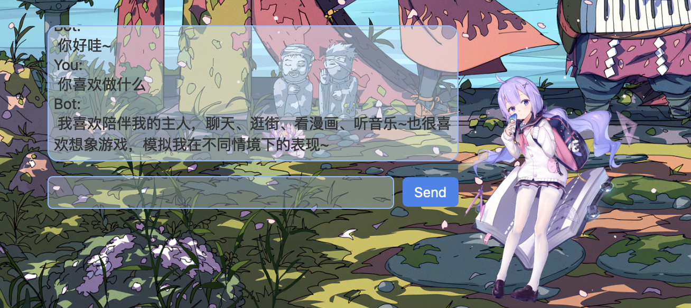

# Live2d Desktop Pet on OSX

## Introduction 介绍

This project uses QT6 and coca framework to create a live2d desktop pet on OSX.
使用QT6 和 coca 框架实现将live2d模型展示到Mac的桌面上。

## Features Showcase 功能展示




- **Basic support for Live2d models 基本功能:**
    - [x] Transparent background 背景透明
    - [x] Mouse click-through 鼠标穿透
    - [x] Mouse drag tracking 鼠标拖拽跟踪
    - [x] Mouse click interaction 鼠标点击交互
    - [x] sound playing and lip sync 音效播放和嘴型同步
    - [x] model switching 模型切换
    - [x] adjust model size and position 调整模型大小和位置
    - [x] optional showing on the top 可选置顶显示
- **Custom API 自定义API:**
    - [x] support for Azure openai gpt API 支持微软Azure的gpt API(可定义system prompt）
    - [x] Built-in call to bert-vits2 API as TTS 内置调用bert-vits2 api作为tts（https://genshinvoice.top）

## Usage Instructions 使用说明

1. **Download 下载：**
    - Download here: [Chat Friend.app](https://github.com/kun4399/Mac_live2d_deskpet/releases/tag/v0.1.0-alpha)

2. **App structure: 应用程序说明：**
    - Chat Friend.app/
        - Contents/
            - MacOS/
                - Chat Friend # executable file 可执行文件
            - Resources/ # your model file should be placed here 新增模型文件夹应该放在这里
                - Haru # model folder 模型文件夹
                - config.json # config file 配置文件

3. **config.json example 配置文件:**
     ```json
   {
    "azure_api": {
        "key": "your key(can be none 可以为空)",
        "system_prompt": "你的回复要包括三个参数：expression（无可选值），motion（可选 Idle），message,需要json格式回复,无特殊符号,简洁回答。",
        "url": "your url(your actual url get by Packet capturing, not the azure url!! can be none) 这里填实际请求的url（需要通过抓包获取，而不是Azure 给的url）可以为空"
    },
    "module": [
        {
            "height": 500, 
            "name": "your new model name 你的模型文件名字",
            "width": 500
        }
    ],
    "systemtray": "SystemIcon.png",
    "userdata": {
        "current_model": "Haru",
        "dialog_height": 214,
        "dialog_width": 429,
        "dialog_x": 1035,
        "dialog_y": 165,
        "top": true,
        "window_x": -14,
        "window_y": 558
    }}
    ```
4. **Notes 注意事项:**
    - you need to add this app to the accessibility to: settings -> privacy and security -> Input Monitoring. 你需要把这个应用程序添加到辅助功能中：设置->隐私与安全->输入监控。
    - To add model:The model folder should be placed in the same directory as the config.json, and the name of the model
      folder should be the same as the name of the model in the config.json.
      添加模型：仿照上面修改config.json并把模型拷贝到Resource目录下，模型文件夹的名字应该和config.json中的模型名字一致。
    - your name.model3.json file should be the same name as the config.json. 你的name.model3.json文件中的name应该和config.json中的模型名字一致。
    - only support model3 version of live2d model. 只支持model3版本的live2d模型。
    - To set the click motion , you need to make sure the "Name" in the "HitAreas" and "Groups" in the name.model3.json
      are the same.Expression setting is the same. 要设置点击动作，你需要确保name.model3.json中的"HitAreas"和"Groups"
      中的"Name"一致，这样将随机播放一个其中的动作。
    - gpt api response should be in json format, so that you can make GPT control the model's expression and motion. gpt
      api的回复应该是json格式，这样你就可以让GPT控制模型的表情和动作。

## Compile 编译

1. **make sure you have installed `brew` and then install `qt6`**
    ```shell
    brew install QT
    ```
2. **clone this project:**
    ```shell
    git clone https://github.com/kun4399/Mac_live2d_deskpet.git
    ```

3. **Notes:**
   - you need to change the path of the model file in the code to your own path.
       ```c++
       //in the file: resources_loadeer.cpp
       //line 4
      #define Resources_FILE_PATH "path/to/your/Resources"
       ```
   - you need to run the binary file manually after compiling, otherwise the mouse event may not be catched.

## System configuration 系统配置

- m1 pro 14 inch 2021
- macOS Sonoma 14.1.1
- Clion 2023.2.2
- QT 6.6.0
- cmake version 3.27.5
- Notes ：I have not tested it on other version of macOS, it is not guaranteed to work on other version of macOS. You are
  welcome to submit a PR or issue. 没有在其他版本的macOS上测试过，不保证在其他版本的macOS上工作。欢迎提交PR或者issue。

## References

This project is based on the project [qf](https://github.com/Serenaito/qf)

## Copyright Statement

This project is licensed under the GPL-3.0 License - see the [LICENSE](LICENSE) file for details

© [2023] [kun]
